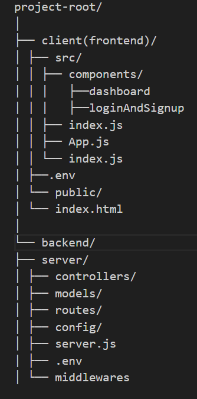

# Project Name

Brief description or introduction of your project.

## Table of Contents

- [Features](#features)
- [Project Structure](#project-structure)
- [Technologies Used](#technologies-used)
- [Getting Started](#getting-started)
  - [Prerequisites](#prerequisites)
  - [Installation](#installation)
- [Running the Application](#running-the-application)


## Features

- Signup and Register
- Admin Dahboard
  - Active Users Count
  - Top Users
  - All Users
  - Upload Data
- Activity Dashboard for normal user
  - Dispalying their activity on the app

## Project Structure



## Technologies Used

List the technologies, frameworks, and libraries used in your project.

- Frontend:
  - React
  - Bootstrap and Raect Bootstrap
  - Tailwind
  - axios
  - formik and yup
  - React Router
  - Papaparser

- Backend:
  - Node.js
  - Express
  - MongoDB
  - Json Web Token,Bcrypt,Joi
  - Fast Csv

  
## Getting Started

### Prerequisites

- Node should be preinstalled on the system.

### Installation

1. Clone the repository:

   ```bash
   git clone https://github.com/vaibhav11269/ids-assessment.git

2. Install Dependencies
    cd ./server
    npm install

    cd ./client
    npm install

3. I've added the environment file here only.

### Running the Application
    cd ./server
    npm start

    cd ./client
    npm start

**Note for uploading users data to server please use .csv file format
The first row is for the headings. 


